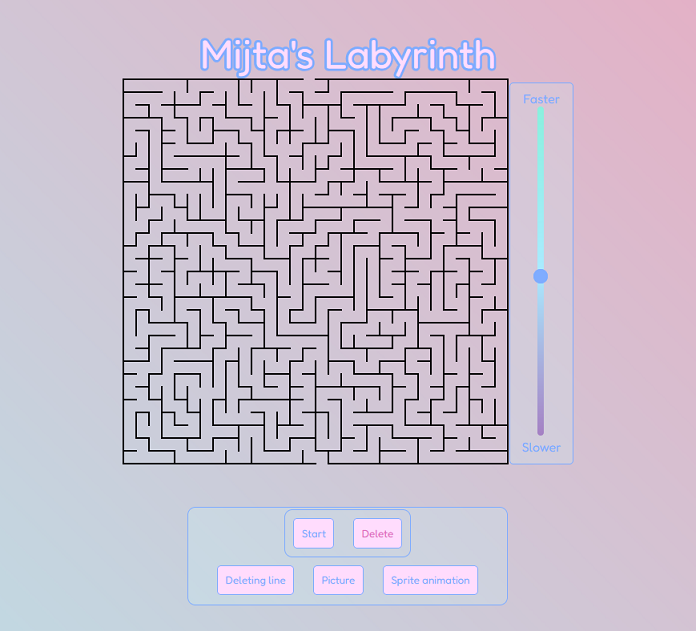

# Labirint

V tem labirintu, ki je narisan kot svg, lahko na različne načine uprizorimo pravilno pot za rešitev labirinta.

## Različni načini rešitve

- Navadna črta, ki jo lahko izbrišemo
- Črta, ki se sama briše
- Slika CD-ja, ki gre skozi labirint
- Sprite animation, ki gre skozi labirint

## Screenshots

## Avtor

- [@Mitja Filej](https://www.github.com/mit72)

