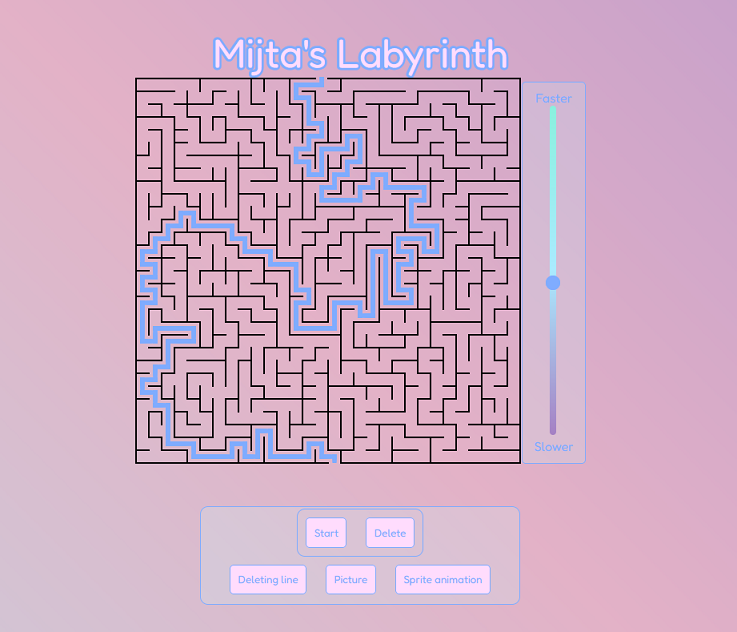

# Labirint

V tem labirintu, ki je narisan kot svg, lahko na različne načine uprizorimo pravilno pot za rešitev labirinta.

## Različni načini rešitve

- Navadna črta, ki jo lahko izbrišemo
- Črta, ki se sama briše
- Slika CD-ja, ki gre skozi labirint
- Sprite animation, ki gre skozi labirint

## Opis

Na teji strani imam labirint narisan kot svg, v katerem z več različnimi načini lahko rešiš labirint. Prvi način je ravna modra črta, ki jo je možno izbristai z gumbom, po tem ko je narisana. Drugi način je z črto, ki se briše sama za sabo. Tretji in četrti način pa vsebujeta element, ki se premika skozi labirint. V tretji opciji je samo slika, ki se premika skozi labirint. V četrti opciji sem uporabil tehniko sprite animation, ki v eni slilki ima shranjenih več majšh slik. Slika na strani je menjanje teh majnšh sličic.

## Slike

## Avtor

- [@Mitja Filej](https://www.github.com/mit72)

